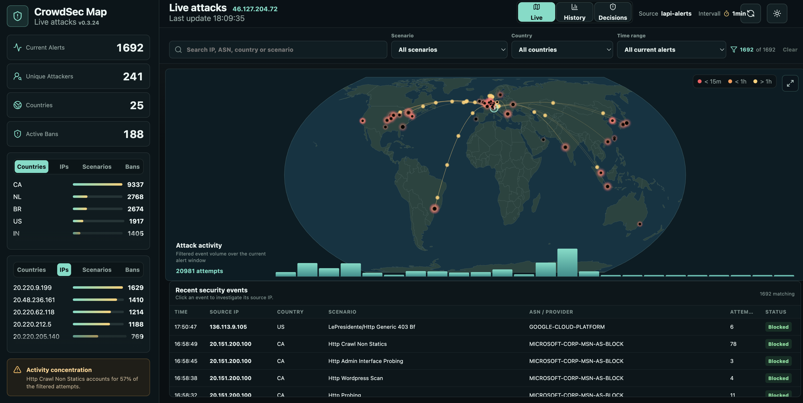

[](https://www.buymeacoffee.com/paddy73.ch)

# CrowdSec Map

CrowdSec Map is a small Docker web app that visualizes CrowdSec alerts and decisions on a live world map. It shows attack origins, active bans, countries, source IPs, scenarios, and a compact timeline for recent activity.

> See where your CrowdSec detections come from, spot patterns at a glance, and investigate a suspicious IP without leaving your dashboard.

## Public demo

Try the [public CrowdSec Map demo](https://crowdsec-map-demo.paddy73.ch). It uses a static snapshot of real CrowdSec alerts; it has no connection to a live CrowdSec deployment and does not expose a target IP.

## Video demos

This recording uses live CrowdSec alert data. The protected target IP is masked.

- [60-second silent demo](docs/demo-assets/crowdsec-map-live-demo-masked.mov)



## Run it in minutes

Use the published image with Docker Compose:

```bash
curl -O https://raw.githubusercontent.com/arman511/crowdsec-map/main/docker-compose.image.yml
docker compose -f docker-compose.image.yml up -d
```

Then open `http://localhost:8088`. Configure LAPI credentials or the `cscli` fallback as described below to display your own CrowdSec data.

**Made for self-hosted CrowdSec deployments:** Docker, Proxmox/LXC, Unraid, and Home Assistant dashboards.

> [!IMPORTANT]
> **Unofficial community project:** CrowdSec Map is an independent project and is not an official CrowdSec product, service, or solution. It is not developed, maintained, endorsed, or supported by CrowdSec. CrowdSec and related names or marks belong to their respective owners.

## Quick Start

For local builds or the existing Proxmox/LXC deployment:

```bash
docker compose up -d --build
```

Enable the local pre-commit checks before contributing:

```bash
make install-hooks
```

The hook runs `cargo check --bin server` and `pnpm build` before each commit.

Open the dashboard:

```text
http://192.168.192.101:8088
```

### Deployment ports

The three deployments on `.101` use separate host ports:

| Environment | Branch | URL |
| --- | --- | --- |
| Production | `main` | `http://192.168.192.101:8088` |
| Development | `dev` | `http://192.168.192.101:8089` |
| Demo | — | `http://192.168.192.101:8090` |

Start the development deployment from the `dev` branch. It uses a separate
container and persistent data volume, so it can run beside production:

```bash
docker compose -p crowdsec-map-dev -f docker-compose.yml -f docker-compose.dev.yml up -d --build
```

When the work is approved, merge `dev` into `main` and deploy `main` normally
on port `8088`.

## Data Sources

The Live map uses `LAPI alerts` as its primary source. In `Auto` mode it falls back to `cscli` and finally to `Sample` if LAPI is unavailable. Enforcement decisions are intentionally separated into the paginated `Decisions` view because blocklists are not detected attacks.

## Dashboard Features

- Toolbar source selection.
- Toolbar refresh interval selection: `30s`, `1min`, `5min`, `30min`.
- Browser-persisted interval, ranking panel selections, and timeline row count.
- `Active Bans` metric in the top-left summary area.
- Ranking panels for `Countries`, `IPs`, `Scenarios`, and `Bans`.
- Search and live filters for source IP, ASN, country, scenario, and alert age.
- Filter-aware attack activity chart and recent security event table.
- Inline event detail drawer with a direct path into full IP investigation.
- Active banned IP list with remaining ban duration.
- Timeline grouped by source IP and minute, expandable up to three rows.
- Cached and server-paginated `Decisions` view for CrowdSec enforcement and blocklist data.
- IP Investigation panel inspired by `csfind`: on-demand log hit counts, 403 counts, sampled log lines, and a paginated `See all` log view with search, filter, and sorting.
- Optional Protection view: derives request volume, HTTP 403/429 blocks, hostname rankings, and a time trend directly from Zoraxy access logs. It does not require Grafana, Prometheus, or an exporter.

## Source Option A: LAPI Alerts (Primary)

Alerts are ideal for the map because CrowdSec often includes `source.latitude`, `source.longitude`, `source.cn`, and `source.as_name`.

1. Register a machine directly on the CrowdSec LAPI host.
2. Set `LAPI_URL`, `LAPI_LOGIN`, and `LAPI_PASSWORD`.

Example:

```yaml
environment:
  DATA_SOURCE: "lapi-alerts"
  LAPI_URL: "http://crowdsec:8080"
  LAPI_LOGIN: "crowdsec-map"
  LAPI_PASSWORD: "your-password"
```

## Source Option B: `cscli` Fallback

In `Auto` mode, CrowdSec Map uses `cscli` only when LAPI Alerts cannot be loaded. This requires access to the Docker socket and a CrowdSec container that can run `cscli alerts list -o json`:

```yaml
environment:
  DATA_SOURCE: "auto"
  CROWDSEC_CONTAINER: "crowdsec"
  CSCLI_COMMAND: "cscli alerts list -o json --limit 0"
volumes:
  - /var/run/docker.sock:/var/run/docker.sock:ro
```

Check the fallback command manually:

```bash
docker exec crowdsec cscli alerts list -o json --limit 5
```

## Decisions View

The dedicated Decisions view uses the configured LAPI bouncer key against
`/v1/decisions`. Decisions can include large Community and third-party
blocklists, so they are cached and paginated separately from alerts. They never
enter the attack Timeline or Recorded History.

```yaml
environment:
  LAPI_URL: "http://crowdsec:8080"
  LAPI_API_KEY: "your-bouncer-key"
```

## Configure CrowdSec access

Create a watcher credential for alerts and provide it through `LAPI_LOGIN` and
`LAPI_PASSWORD`, or use the `cscli` fallback with read-only Docker socket access.
Keep credentials in a local `.env` file and do not commit it. See the [setup
guide](docs/setup-assistant.md) for the manual steps.

## Environment Variables

| Variable | Purpose |
| --- | --- |
| `PORT` | Web/API port inside the container; default `8088` |
| `DATA_SOURCE` | Live source: `auto`, `lapi-alerts`, `cscli`, `sample`, or `demo-snapshot`; default `auto` |
| `DEMO_MODE` | Use demo data for decisions and suppress live bans; default `false` |
| `REFRESH_SECONDS` | Live dashboard refresh interval in seconds; default `30` |
| `ATTACKS_CACHE_SECONDS` | Live response cache duration; default `5` |
| `PROTECTION_REFRESH_SECONDS` | Protection aggregate refresh interval in seconds; default `3600` |
| `STATIC_DIR` | Built frontend directory; default `dist` |
| `CROWDSEC_CONTAINER` | Container used for `docker exec ... cscli` |
| `CSCLI_COMMAND` | Alert command run in the CrowdSec container; default `cscli alerts list -o json --limit 0` |
| `LAPI_LIMIT` | Maximum LAPI alert records; default `0` loads all records |
| `LAPI_URL` | CrowdSec LAPI URL; default `http://127.0.0.1:8080` |
| `LAPI_LOGIN` / `LAPI_PASSWORD` | Watcher credentials for alerts |
| `LAPI_API_KEY` | Bouncer key for decisions |
| `LAPI_CREDENTIALS_FILE` | Credentials file path; default `data/lapi-credentials.json` |
| `DEMO_SNAPSHOT_FILE` | Snapshot file for `demo-snapshot`; default `data/demo-snapshot.json` |
| `PUBLIC_TARGET_IP` | Optional public target IP shown in the dashboard header; otherwise the service tries public IP providers |
| `HISTORY_DATABASE_FILE` | Persistent SQLite history database; default `data/history.db` |
| `HISTORY_RETENTION_DAYS` | History retention window; default `90` |
| `CTI_API_KEY` | Optional CTI key for IP reputation checks |
| `CTI_API_URL` | CTI API base URL; default `https://cti.api.crowdsec.net/v2` |
| `CTI_CACHE_FILE` | Persistent CTI cache; default `data/cti-cache.json` |
| `CTI_CACHE_HOURS` | CTI cache duration; default `72` |
| `ACCESS_LOG_ENABLED` | Optional demo visit logging; default `false` |
| `ACCESS_LOG_FILE` | Visit log path; default `data/access-log.jsonl` |
| `ACCESS_LOG_RETENTION_DAYS` | Visit log retention; default `30` |
| `INVESTIGATION_LOG_PATHS` | Comma, semicolon, or newline-separated log paths/globs |
| `INVESTIGATION_MAX_LINES` | Sampled lines per investigation source; default `50` |
| `INVESTIGATION_TIMEOUT_MS` | Investigation and Protection scan timeout; default `30000` |
| `PROTECTION_LOG_PATHS` | Access-log paths/globs used by Protection |
| `LOG_LEVEL` | Tracing filter; default `info` |

## History storage

Recorded alert history is stored in SQLite at `HISTORY_DATABASE_FILE`. The
database is initialized on startup and should be persisted through the supplied
`/app/data` volume. Records older than `HISTORY_RETENTION_DAYS` are removed
during history maintenance.

## IP Investigation

The IP detail overlay scans configured, read-only mounted log paths for the
selected IP and history window. This is the web-app equivalent of the original
`csfind` workflow: compare CrowdSec context with reverse proxy, MFA, Proxmox, or
other access logs.

Default investigation paths are:

```text
/var/log/zoraxy/*.log*
/opt/security-stack/zoraxy/config/log/*.log*
/opt/security-stack/authelia/config/authelia.log
/var/log/pveproxy/access.log
```

When CrowdSec Map runs in Docker, mount matching host paths into the container
read-only and use the paths visible inside the container. If no configured files
are readable, the UI shows a warning instead of failing the page.

## Docker Image, Unraid, and Home Assistant

The default `docker-compose.yml` builds the image locally and expects the
external `security-stack_proxy` Docker network. Create that network first, or
remove the network section when using another network.

The optional image Compose file uses:

```text
ghcr.io/arman511/crowdsec-map:latest
```

Verify that the image is available to your Docker host before using it. The
Unraid guide describes a manual container setup; no Unraid template is tracked
in this checkout. Home Assistant embedding is covered by
[docs/home-assistant.md](docs/home-assistant.md).

## Local Development

The frontend scripts use `pnpm`:

```bash
cd frontend
pnpm install
pnpm dev
```

This starts Vite at `http://localhost:5173` and the Rust backend at
`http://localhost:8088`; Vite proxies `/api` requests to the backend. To run
the backend by itself:

```bash
cd backend
cargo run --bin server
```

Useful checks are `pnpm lint`, `pnpm build`, and `cargo check --bin server`.

## Notes

- If CrowdSec does not provide coordinates, the app uses the DB-IP country database when available.
- If `DATA_SOURCE=auto` cannot reach a real source, the app falls back to sample data and shows a warning in the timeline.
- Using `cscli` from a separate container requires Docker socket access. Use LAPI if you want to avoid mounting the Docker socket.

## License

CrowdSec Map is released under the GNU Affero General Public License v3.0 only. See [LICENSE](LICENSE).
